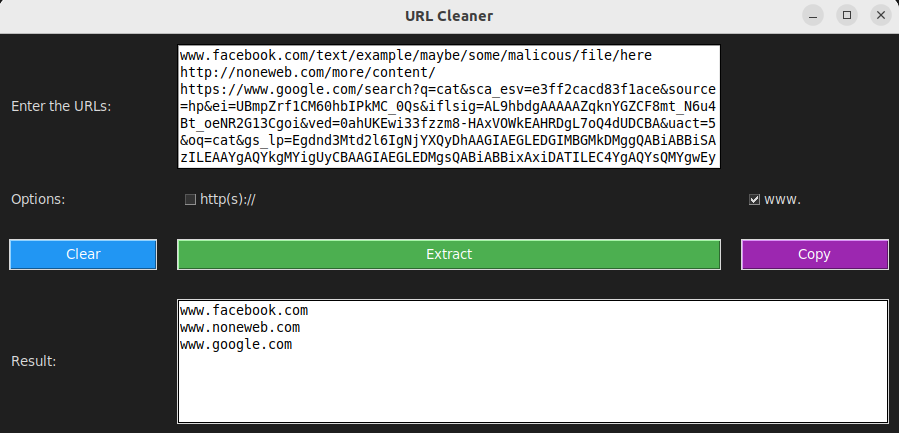

# URLCleaner 🧹

# Introduction  📕 

URL Cleaner is a simple Python application for cleaning and formatting URLs. The application allows to input a list of URLs and provides options to adjust the output format, such as adding the `http(s)://` scheme and the `www.` prefix.

## Installation  💿

1. **Clone the Repository:**

```bash
git clone https://github.com/your-username/url-cleaner.git
cd url-cleaner
sudo chmod +x urlcleaner.py
```

2. **Install Dependencies:**

Ensure you have Python installed. The code uses the Tkinter library, which is generally included with Python. If not, you can install it with:

```bash
pip install tk
``` 
```
python3 urlcleaner.py
```
## Usage ▶️
**Enter URLs:**
Type or paste a list of URLs into the upper text area.

**Select Options:**
Check the checkboxes to add `http(s)://` and/or `www`.

**Extract Results:**
Click the Extract button to process the URLs and display the results in the lower area.

**Clear:**
Use the Clear button to remove the input and result text.

**Copy Results:**
Use the Copy button to copy the results to the clipboard.

--- 
## Screenshoots 🖼️
### Default Option
The output will include only the domain name, excluding any scheme (e.g., `http`, `https`) or `www` prefix.


### HTTP Option
Adds `http` to the result. If the input URL includes `https`, it will be maintained as `https`.


### WWW Option
Adds `www` to the output.


### Both Options Selected
Combines both options by adding `http` and `www` to the result.

